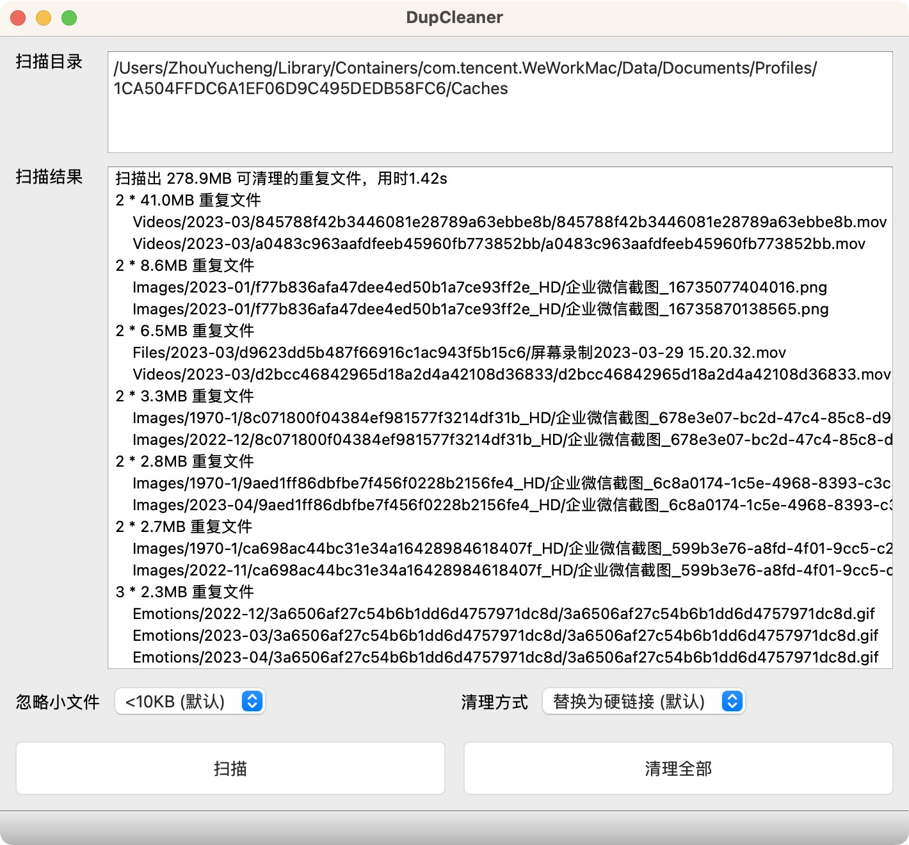

DupCleaner (Duplicate Cleaner 重复文件清理器) 可以用于清理电脑中重复文件，释放储存空间。

例如，”文档A“、”文档A(1)“、”文档A(2)“ 三份文件内容完全相同，则DupCleaner可将其扫描出来，并将多余的两份进行清理，释放2/3的空间。

## 产品特点

DupCleaner并非将重复文件进行简单的删除，而是将其替换为硬/软连接（几乎不占额外空间），因此清理完毕后，原来的重复文件仍然可以被点击打开，非常安全和有利于兼容。  

需注意：在清理后，原来的重复文件共同占用一份空间，对任何一个文件内容进行改动，其它重复文件也会同时改动。

## 脚本使用说明

本应用的Python脚本开源免费，可直接下载后使用。

进入dupcleaner目录，运行如下命令可开始扫描（之后根据提示输入可选择清理或退出）：

```
python3 dupcleaner.py dirpath1 [dirpath2] [dirpath3]
```

## App使用说明

本应用的图形界面App基于Qt (PySide6) 开发，需收费 (购买激活码) 使用。

下载地址：https://github.com/zhouyc98/DupCleaner/releases/latest

(Mac用户安装时若出现“已损坏，无法打开”的提示，可在终端运行`sudo spctl --master-disable` 以允许任何来源下载的 App 运行，详细可参考[这篇文章](https://zhuanlan.zhihu.com/p/135948430))



**扫描目录**：输入需扫描的文件夹路径，多个路径可用换行分隔，支持通配符，支持文件拖拽。

**扫描结果**：右键点击可打开文件或其所在目录。MacOS下可按空格键预览文件。

**扫描**：扫描输入扫描目录及其递归子目录下的所有重复文件。
重复文件的判定方式为：文件扩展名相同+内容完全相同(SHA-256)。

**清理全部**：清理所有扫描出的重复文件：对于N个重复文件，会将修改日期较新的N-1项删除并替换为指向原始文件的硬链接或软连接。

* 硬链接(推荐)：与普通文件等价，当文件被多个硬链接指向时只占用一份空间，只有全部硬链接被删除后文件才会被操作系统真正删除
* 软链接：与快捷方式类似，当原文件被移动或删除后，软连接会成为无效的链接

点击文件菜单，可添加微信、企业微信应用的默认文件缓存目录。

## App购买激活

App未激活时，最多可清理1MB重复文件。购买激活码，可解除所有限制。  

购买链接：https://v2geek.com/zhouyc/DupCleaner

联系我们：[zhouyucheng98@163.com](mailto:zhouyucheng98@163.com)

(Icon made by [Freepik](https://www.flaticon.com/authors/freepik) from www.flaticon.com)

